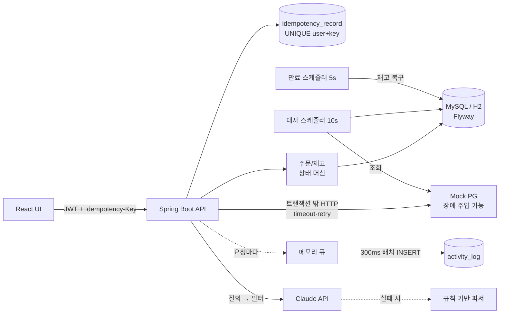
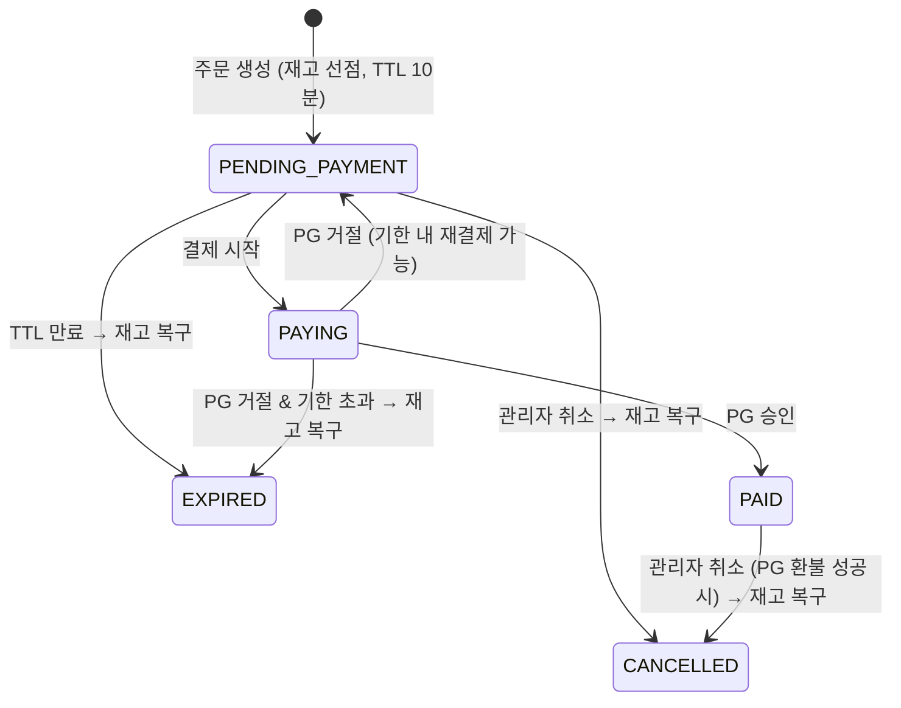

# ⚡ FlashDeal

**선착순 한정 특가(플래시 딜) 쇼핑몰의 주문·결제 시스템**

"재고 100개짜리 상품에 1,000명이 동시에 주문하면 어떻게 될까?"라는 질문에서 시작한 개인 프로젝트입니다.
트래픽이 한순간에 몰리는 커머스에서 **재고와 돈이 어긋나지 않게** 만드는 것을 목표로, 문제를 직접 재현하고 원인을 찾아 고친 뒤 수치로 확인하는 과정을 기록했습니다.

<br>

## 프로젝트 목표

- 동시 주문이 몰려도 **초과 판매 0건**. 재고 차감 방법 4가지를 모두 구현하고 **MySQL에서 같은 조건으로 측정**해서 고릅니다.
- 따닥 클릭, 네트워크 재전송, 외부 결제(PG) 장애가 있어도 **주문·결제·재고가 서로 일치**하게 합니다.
- H2에서만 통과하는 코드가 아니라, **운영과 같은 DB(MySQL)에서 검증**합니다.
- 기능 구현에서 끝내지 않고 **문제 재현 → 원인 분석 → 해결 → 수치 확인** 과정을 문서로 남깁니다.
- 관리자 화면, 활동 로그, 요청 추적(traceId), 장애 주입 도구처럼 **운영에 필요한 도구**까지 만듭니다.

<br>

## 기술 스택

| 분류 | 기술 | 선택 이유 |
|---|---|---|
| Backend | Java 21, Spring Boot 3.5, Spring Data JPA | |
| Auth | Spring Security + JWT | 세션 저장소 없이 서버를 늘릴 수 있게. JWT의 약점인 즉시 무효화는 `token_version`으로 보완 ([#13](docs/issues/09-auth.md)) |
| Database | **MySQL 8 (InnoDB)**, H2 | 락과 격리 수준은 DB마다 다르게 동작해서, 운영과 같은 MySQL에서 측정·테스트. H2는 설치 없는 로컬 실행용 |
| Migration | Flyway + `ddl-auto: validate` | 스키마 변경 이력을 코드로 관리하고, 엔티티와 스키마 불일치를 서버 기동 시점에 발견 |
| Cache | Caffeine | 탈퇴·정지 즉시 반영을 위한 사용자 상태 조회와 LLM 검색 결과를 요청마다 DB·외부 API 없이 처리. 단일 서버라 로컬 캐시로 충분 |
| AI | Claude API (Anthropic Java SDK, Structured Outputs) | 응답을 JSON Schema로 강제해서 자유 텍스트 파싱 실패를 없앰. 장애 시 규칙 기반 파서로 폴백 |
| Frontend | React 19, TypeScript, Vite, React Router | |
| Test / Tool | JUnit 5, Node 부하 테스트 스크립트, Swagger, GitHub Actions, Docker Compose | 테스트 69개를 H2와 MySQL 양쪽에서 실행 |
| (쓰지 않음) | Redis 분산락 | 재고가 DB 한 행에 있어서 DB 락으로 원자성이 보장됨. 분산락은 DB 밖 자원을 조율할 때 쓰는 도구라고 판단 ([자세히](docs/issues/01-stock-concurrency.md#왜-redis-분산락을-쓰지-않았나)) |

<br>

## 주요 결과

| 주제 | Before | After |
|---|---|---|
| 동시 주문 2,000건 (MySQL) | 락 없음: 2,000개를 팔았는데 재고는 **74개만 줄어듦** | 초과 판매 **0건** |
| 인기 상품 경합 (MySQL, 2회 측정) | 낙관적 락: TPS 24~32, p99 6~14초, 주문의 **35%가 재고가 남았는데 실패** | 원자적 UPDATE: TPS 110~133, p99 1.9~2.4초, 실패 0건 |
| 1인 구매 제한 2개, 동시 요청 10건 (MySQL) | 락을 걸었는데도 **4개 판매** (REPEATABLE READ 스냅샷) | 정확히 **2개** |
| 내 주문 목록 인덱스 (MySQL `EXPLAIN ANALYZE`) | 다른 사용자 주문까지 **994행** 읽음 | 복합 인덱스로 **10행** |
| 주문 목록 조회 (주문 20건) | 22 쿼리 (N+1) | **3 쿼리** |
| 같은 멱등 키로 동시 주문 20건 | 중복 주문 가능 | 정확히 **1건** |
| PG 승인 직후 우리 서버 장애 | 돈은 빠졌는데 주문은 "결제 중" | 대사 배치가 PG 기준으로 **자동 복구** |
| 관리자 재고 조정 (데모 DB) | 덮어쓰기 → 한정 100개 상품 재고가 **16,602개**로 부풂 | 증감(입고/출고) 조정으로 실물 수와 일치 |
| 탈퇴·정지 후 기존 JWT | 만료(2시간)까지 계속 사용 가능 | **다음 요청부터 거부** |

<br>

## 기술적 이슈 해결 과정

- [#1] [재고 100개에 1,000명이 몰릴 때: 재고 차감 전략 4가지를 MySQL에서 실측 비교](docs/issues/01-stock-concurrency.md)
- [#2] [부하 테스트 결과가 뒤집힌 이유: 경합을 재지 못하던 측정 설계를 다시 짠 이야기](docs/issues/01-stock-concurrency.md#측정-설계를-다시-한-이야기)
- [#3] [락을 걸었는데도 1인 구매 제한이 뚫린 이유: MySQL REPEATABLE READ의 스냅샷](docs/issues/02-purchase-limit.md)
- [#4] [SELECT FOR UPDATE가 옛날 재고를 돌려준 이유: 영속성 컨텍스트와 DTO 프로젝션](docs/issues/02-purchase-limit.md)
- [#5] [readOnly 트랜잭션 안의 INSERT가 MySQL에서만 거부된 이유](docs/issues/03-readonly-transaction.md)
- [#6] [관리자가 상품명을 고쳤더니 재고가 되돌아간 이유: 변경 감지와 `@DynamicUpdate`](docs/issues/04-stock-lost-update.md)
- [#7] [한정 100개 상품의 재고가 16,602개가 된 이유: 재고는 덮어쓰지 않고 증감한다](docs/issues/04-stock-lost-update.md)
- [#8] [따닥 클릭과 재전송으로 주문이 두 번 생기는 문제: Idempotency-Key와 유니크 제약](docs/issues/05-idempotency.md)
- [#9] [PG는 승인했는데 우리 DB는 모를 때: 트랜잭션 분리, UNKNOWN 상태, 대사 배치](docs/issues/06-payment-failure.md)
- [#10] [거절된 결제를 승인으로 오판할 뻔한 버그: HTTP 200과 결제 상태](docs/issues/06-payment-failure.md)
- [#11] [재고는 언제 빼야 하나: 주문 시점 선점 + TTL, 그리고 며칠 뒤 사라지는 특가](docs/issues/07-stock-reservation.md)
- [#12] [주문 목록 조회: N+1은 22 → 3 쿼리, 인덱스로 읽는 행은 994 → 10](docs/issues/08-query-performance.md)
- [#13] [탈퇴·정지한 회원의 JWT가 계속 살아 있는 문제: token_version과 캐시](docs/issues/09-auth.md)
- [#14] [로그 저장 때문에 주문이 느려지면 안 된다: 활동 로그 비동기 배치 적재](docs/issues/10-activity-log.md)
- [#15] [LLM 검색이 상품을 지어내지 않게, 그리고 "마으수"를 "마우스"로: 한글 자모 오타 교정](docs/issues/11-ai-search.md)

<br>

## 프로젝트 중점사항

- **재고 차감은 쿼리 하나로**: `UPDATE ... SET stock = stock - ? WHERE stock >= ?`로 검사와 차감을 한 번에 처리해 락을 쥐는 시간을 최소화 (4가지 전략 비교 후 채택)
- **충돌 빈도에 따라 다른 동시성 제어**: 재고는 원자적 UPDATE, 주문 상태 변경은 낙관적 락(`@Version`), 1인 구매 제한은 사용자 행 락. 여러 상품의 락은 id 순서로 잡아 데드락 예방
- **격리 수준을 기본값에 맡기지 않음**: 락 이후의 조회가 최신 커밋을 보도록 주문 생성 트랜잭션만 `READ COMMITTED`로 명시
- **중복 방지는 애플리케이션 락이 아니라 DB 유니크 제약으로**: 서버가 여러 대여도 동작 (멱등 키, 동시 회원가입)
- **외부 결제 호출은 트랜잭션 밖에서**: PG 지연이 DB 커넥션 고갈로 번지지 않게. 타임아웃은 실패가 아니라 "모름(UNKNOWN)"으로 두고 대사 배치로 확정
- **돈과 재고가 걸린 순서를 지킴**: 결제 결과를 모르는 주문은 만료·취소 대상에서 제외, 환불은 PG 환불이 성공한 뒤에만 우리 쪽 상태 변경
- **재고는 덮어쓰지 않고 증감으로**: 관리자 조정과 재고 복구는 `stock = stock + :delta`. 가용 재고와 결제 대기 수량을 따로 표시
- **테스트는 운영과 같은 DB에서도**: 같은 테스트 69개를 `./gradlew test -Pdb=mysql`로 MySQL에서 실행
- **부가 기능이 핵심 흐름을 막지 않게**: 활동 로그는 비동기 배치 적재(실패 시 버림), LLM 장애 시 규칙 기반 폴백
- **요청 하나를 끝까지 추적**: traceId를 서버 로그, 에러 응답, 응답 헤더, 활동 로그에 연결

<br>

## 재고 차감 전략 비교 (MySQL 8 실측)

재고 2,000 / 주문 2,000건 / 동시 100. 모든 요청이 같은 재고 행을 두고 경합하도록 맞추고, 같은 조건으로 두 번 측정했습니다.

| 전략 | 구현 | TPS | p99 | 결과 |
|---|---|---|---|---|
| NAIVE | 조회 후 변경 감지 | 106 / 137 | 3.8 / 2.4초 | 2,000개를 팔았는데 재고는 **74개만 줄어듦** |
| PESSIMISTIC | `SELECT ... FOR UPDATE` | 98 / 126 | 3.2 / 2.0초 | 정확 |
| OPTIMISTIC | version 비교 + 트랜잭션 밖 재시도 | **24 / 32** | **14.0 / 6.2초** | **35%가 재고가 남았는데 실패** |
| **ATOMIC_UPDATE** (채택) | `UPDATE ... WHERE stock >= ?` | **110 / 133** | **2.4 / 1.9초** | 정확 |

로컬 노트북, 서버 1대 기준이라 절대 수치보다 같은 조건에서의 상대 비교로 봐야 합니다. H2 결과, JUnit 동시성 테스트 결과, 해석은 [#1 문서](docs/issues/01-stock-concurrency.md)에 있습니다.

<br>

## 아키텍처



### 결제 흐름

```
[TX1] 주문 PAYING + 결제 REQUESTED 기록  →  PG 승인 요청 (트랜잭션 밖)  →  [TX2] 결과 반영
                                                  │
                                    타임아웃 = UNKNOWN → 대사 배치가 PG 조회로 확정
```

### 주문 상태 머신



**PAYING은 만료 스케줄러도, 관리자 취소도 건드리지 않고 대사로만 빠져나갑니다.** 결제 결과를 모르는 상태에서 재고를 풀면 "돈은 빠졌는데 상품은 다른 사람에게 팔린" 상황이 생기기 때문입니다.

<br>

## ERD

```mermaid
erDiagram
    users ||--o{ orders : "user_id"
    users ||--o{ idempotency_record : "user_id"
    users ||--o{ activity_log : "user_id (nullable)"
    orders ||--|{ order_item : "order_id (FK)"
    product ||--o{ order_item : "product_id (스냅샷)"
    orders ||--o{ payment : "order_id"

    users { bigint id PK; varchar login_id UK "탈퇴 시 NULL"; varchar email UK; varchar password; varchar name; varchar role; varchar status "ACTIVE/SUSPENDED/WITHDRAWN"; int token_version "JWT 무효화"; int failed_login_count; datetime locked_until }
    product { bigint id PK; varchar name; varchar category; varchar sub_category; bigint price; bigint original_price; int stock; int sold_count; bigint version; datetime deal_start_at; datetime deal_end_at; int deal_quantity; int per_user_limit; boolean active; varchar specs "JSON"; varchar images "JSON" }
    orders { bigint id PK; varchar order_no UK; bigint user_id; varchar status; bigint total_amount; datetime expires_at; bigint version }
    order_item { bigint id PK; bigint order_id FK; bigint product_id; varchar product_name "스냅샷"; bigint unit_price "스냅샷"; int quantity }
    payment { bigint id PK; bigint order_id; varchar payment_key UK "PG 멱등 키"; bigint amount; varchar status; varchar pg_transaction_id; bigint version }
    idempotency_record { bigint id PK; bigint user_id; varchar idempotency_key; varchar request_hash; varchar status; int response_status; varchar response_body }
    activity_log { bigint id PK; bigint user_id; varchar event_type; varchar method; varchar target; int status_code; int latency_ms; varchar request_id; varchar detail "JSON" }
```

- `order_item`은 상품명과 가격을 **스냅샷**으로 저장합니다. 상품 가격이 바뀌어도 주문 내역은 그대로여야 하고, 목록 조회에 상품 조인이 필요 없어집니다.
- 스펙과 이미지 목록은 상품과 항상 같이 읽으므로 별도 테이블 대신 JSON 문자열 컬럼에 둡니다.
- 상품은 삭제하지 않고 판매 중지(`active=false`)합니다. 과거 주문과 로그가 참조하기 때문입니다.

<br>

## 화면 구성

| 화면 | 경로 | 주요 기능 |
|---|---|---|
| 쇼핑몰 | `/` | 카테고리 사이드바(대분류 › 소분류), 오늘의 특가, 정렬·가격대·품절 필터(URL과 동기화), AI 자연어 검색과 조건 칩, 오타 교정 |
| 상품 상세 | `/products/:id` | 이미지 갤러리, 할인율, 오픈/마감 카운트다운, 한정 수량 진행바, 1인 구매 제한, 스펙 표 |
| 로그인 · 회원가입 | `/login`, `/signup` | 아이디/이메일 로그인, 5회 실패 시 잠금, 아이디 중복 확인 |
| 내 활동 · 계정 | `/me`, `/me/account` | 주문·결제 내역, 최근 검색어, 최근 본 상품, 모든 기기 로그아웃, 회원 탈퇴 |
| 관리자 | `/admin` | 대시보드(요청 수, 에러율, 응답 시간), 활동 로그(사용자별 타임라인, traceId), 회원 관리(정지, 강제 로그아웃, 잠금 해제), 상품·특가 관리(재고 입고/출고), 주문 관리(취소·환불) |
| 테스트 실험실 | `/admin/lab` | 재고 전략 전환, 동시성 테스트, 멱등성 테스트, 결제 장애 주입, 대사·만료 즉시 실행, 정합성 점검 |

### 역할별 권한 (서버에서 검사)

| 기능 | 비로그인 | USER | ADMIN |
|---|:-:|:-:|:-:|
| 상품 목록·상세·카테고리·AI 검색 | ✅ | ✅ | ✅ |
| 주문·결제, 내 주문 조회 | 401 | 본인 것만 (남의 주문은 **404**) | 본인 것만 |
| 내 활동 `/api/users/{id}/activity` | 401 | 본인만 (남의 id는 **403**) | 본인만 |
| 관리자 API `/api/admin/**` | 401 | 403 | ✅ |

프론트엔드의 메뉴 숨김은 편의일 뿐이고, 권한은 모두 서버가 검사합니다.

<br>

## API

<details>
<summary>전체 목록 펼치기 (실행 후 <code>/swagger-ui.html</code>에서도 볼 수 있습니다)</summary>

| 메서드 | 경로 | 권한 | 설명 |
|---|---|---|---|
| POST | `/api/auth/signup`, `/api/auth/login` | 전체 | 회원가입, 로그인 (JWT 발급) |
| GET | `/api/auth/check-login-id?value=` | 전체 | 아이디 사용 가능 여부 |
| GET / DELETE | `/api/me` | USER | 내 정보 / 회원 탈퇴 (비밀번호 확인) |
| POST | `/api/me/logout-all` | USER | 모든 기기에서 로그아웃 |
| GET | `/api/categories` | 전체 | 카테고리 트리 + 상품 수 |
| GET | `/api/products` | 전체 | 목록 (`category, sub, deal, minPrice, maxPrice, excludeSoldOut, keyword, sort`) |
| GET | `/api/products/{id}` | 전체 | 상세 (스펙, 이미지, 관련 상품) |
| GET | `/api/products/search?q=` | 전체 | AI 자연어 검색 |
| POST | `/api/orders` | USER | 주문 생성 (재고 선점), `Idempotency-Key` 필수 |
| POST | `/api/orders/{id}/payment` | USER | 결제, `Idempotency-Key` 필수 (200 완료 / 202 확인 중 / 402 거절) |
| GET | `/api/orders`, `/api/orders/{id}` | USER | 내 주문 |
| GET | `/api/users/{id}/activity` | USER | 내 활동 |
| GET | `/api/admin/activity`, `/api/admin/activity/summary` | ADMIN | 활동 로그, 대시보드 요약 |
| GET / PATCH / POST | `/api/admin/users`, `/{id}/status`, `/{id}/logout`, `/{id}/unlock` | ADMIN | 회원 목록, 정지·해제, 강제 로그아웃, 잠금 해제 |
| GET / POST / PUT / PATCH | `/api/admin/products`, `/{id}`, `/{id}/active` | ADMIN | 상품·특가 관리, 판매 중지 |
| POST | `/api/admin/products/{id}/stock-adjustments` | ADMIN | 재고 조정 `{delta, reason}` (입고 +N / 출고 -N) |
| GET / POST | `/api/admin/orders`, `/api/admin/orders/{id}/cancel` | ADMIN | 주문 조회, 취소(환불) |
| GET / PUT | `/api/admin/stock-strategy`, `/api/admin/stock-strategy/{type}` | ADMIN | 재고 전략 조회 / 전환 |
| POST | `/api/admin/tools/concurrency-test` | ADMIN | 동시성 테스트 |
| GET / PUT / DELETE | `/api/admin/chaos` | ADMIN | Mock PG 장애 주입 |
| POST | `/api/admin/reconcile`, `/api/admin/expire` | ADMIN | 결제 대사, 만료 정리 즉시 실행 |
| GET | `/api/admin/consistency-report` | ADMIN | 주문 ↔ 결제 정합성 리포트 |

</details>

<br>

## 실행 방법

```bash
# 백엔드 (H2, 설치 없이 바로 실행) → http://localhost:8080
cd backend && ./gradlew bootRun

# 백엔드 (MySQL 8)
cd backend && SPRING_PROFILES_ACTIVE=mysql DB_USER=root DB_PASSWORD=<비밀번호> ./gradlew bootRun

# 프론트엔드 → http://localhost:5173
cd frontend && npm install && npm run dev

# 테스트 (H2 / MySQL)
cd backend && ./gradlew test
cd backend && DB_PASSWORD=<비밀번호> ./gradlew test -Pdb=mysql

# 부하 테스트 (서버 실행 중)
node loadtest/order-rush.mjs --all --stock 2000 --requests 2000
```

| 아이디 | 비밀번호 | 권한 |
|---|---|---|
| user1 | user1234! | USER |
| user2 | user1234! | USER |
| admin | admin | ADMIN (데모용. 운영에서는 `ADMIN_PASSWORD`로 교체) |

설정, 부하 테스트 옵션, API 호출 예시, 기능 둘러보기 순서는 [실행 가이드](docs/guide.md)에 있습니다.
상품 이미지는 Wikimedia Commons의 자유 라이선스 사진입니다 ([IMAGE_CREDITS.md](IMAGE_CREDITS.md)).

<br>

## 프로젝트 구조

<details>
<summary>펼치기</summary>

```
backend/src/main/java/com/flashdeal
├── auth/          회원가입·로그인·탈퇴, JWT + 토큰 버전 검증, SecurityConfig
├── product/       상품, 카테고리, 필터·정렬, stock/ 재고 차감 전략 4가지
├── order/         상태 머신, 주문 생성(재시도 Facade), 1인 제한, 만료 스케줄러, 취소
├── payment/       PG 클라이언트(타임아웃·재시도·환불), 트랜잭션 분리, 대사 배치
├── mockpg/        가짜 PG 서버 + 장애 주입 설정
├── idempotency/   Idempotency-Key 처리
├── activity/      활동 로그 필터, 비동기 배치 적재, 조회 API
├── ai/            Claude 질의 파서, 규칙 기반 폴백, 캐시, 오타 교정
├── admin/         관리자 API(상품·주문·회원·재고), 동시성 테스트 도구
└── common/        에러 코드, 전역 예외 처리, traceId 필터, 데모 데이터
backend/src/main/resources/db/migration   Flyway 마이그레이션 (V1~V4)
frontend/src
├── pages/         쇼핑, 상세, 내 활동, auth/(로그인·가입·계정), admin/(대시보드·로그·회원·상품·주문·실험실)
└── components/    헤더, 카테고리 사이드바, 상품 카드, 이미지
docs/issues/       기술적 이슈별 문제 → 원인 → 해결 → 결과
docs/guide.md      실행 가이드
loadtest/          HTTP 부하 테스트
scripts/           상품 이미지 수집
```

</details>

<br>

## 한계와 다음 단계

- **서버 한 대 기준입니다.** 서버를 여러 대로 늘리면 스케줄러 중복 실행 방지(ShedLock 등), 사용자 상태 캐시 삭제 전파(Redis pub/sub), 인스턴스별 활동 로그 큐를 손봐야 합니다. 멱등성, 재고, 1인 구매 제한은 DB 제약과 락에 기대므로 그대로 동작합니다.
- **결제 결과 반영은 동기 방식입니다.** 트래픽이 커지면 Outbox 패턴과 메시지 큐로 분리하는 것이 다음 단계입니다.
- **DB가 한계에 도달하면** 락을 더하는 대신 Redis `DECR`로 재고 게이트를 앞단에 두고 DB에는 비동기로 반영하는 구조를 검토합니다.
- 멱등 레코드가 처리 중(IN_PROGRESS) 상태로 서버가 죽으면 그 키는 409로 남습니다. 오래된 레코드를 정리하는 배치가 필요합니다.
- 특가를 상품 속성이 아니라 회차(deal round) 엔티티로 분리하면 회차별 한정 수량과 판매량을 따로 관리할 수 있습니다.
- CI(GitHub Actions)는 H2로 테스트합니다. Testcontainers로 CI에서도 MySQL 테스트를 돌리는 것이 다음 단계입니다.
- 아직 검증하지 못한 부분: Claude API 실제 호출(API 키가 없어 제어 흐름만 스텁 테스트로 검증), Docker Compose와 GitHub Actions 워크플로(구성만 해 두고 실행 전)
